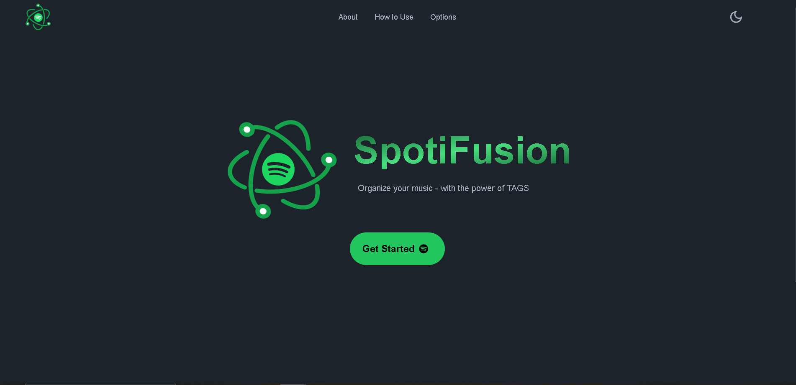
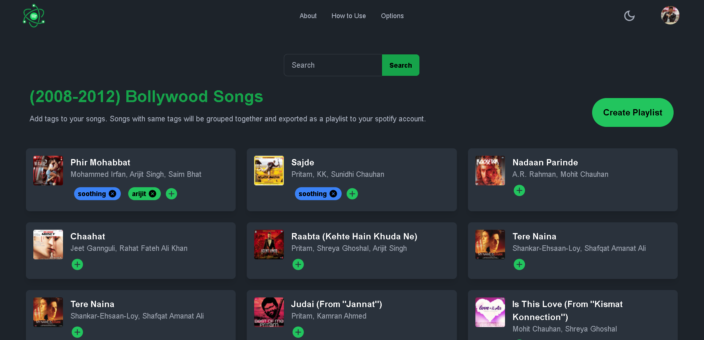
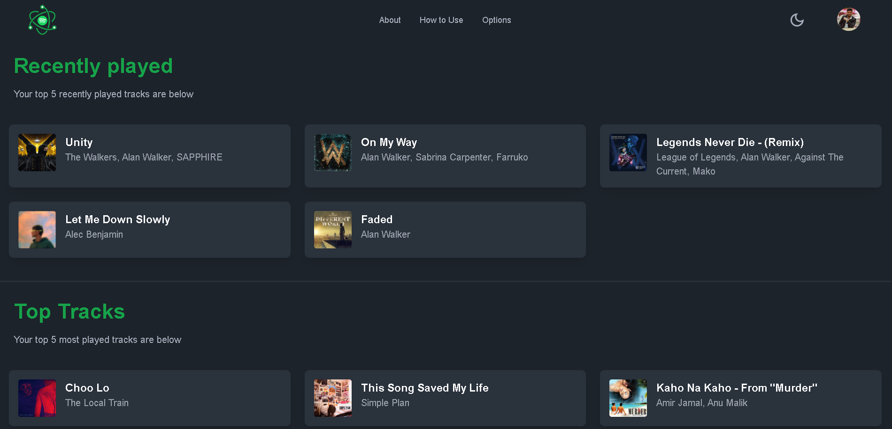

# SpotiFusion
- SpotiFusion is a Music Organizer web application 
- It allows user to create, modify playlist on the basis of TAGS
- This application makes it eay to sort through large music libraries
- You can also see your spotify analytics like recently played, top tracks and top artists etc.

## Technologies used
- Next.js 14
- Tailwind CSS
- Spotify API
- Zustand
- MongoDB
- JavaScript

## Images

